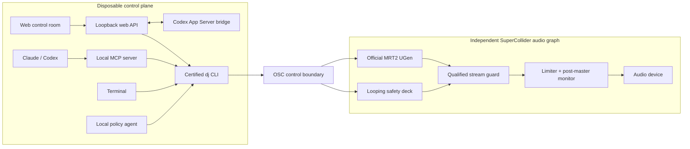

<p align="center">
  
</p>

<h1 align="center">Agent DJ</h1>

Agent DJ is a functioning local-first generative music system. The official Magenta RealTime 2
SuperCollider UGen generates a continuous stream, SuperCollider keeps a looping safety deck ready
underneath it, and a separate local agent turns observations into scheduled musical intent.

The central rule is simple: **music must not stop**. Model loading, prompt encoding, policy,
analysis, network access, and file work never run in the real-time audio callback. The safety deck
keeps looping if the web app, policy agent, Codex bridge, or MRT2 output disappears.

## Architecture



MRT2 must produce sustained signal for two seconds before the guard admits it. A 120 ms stream
lookahead lets the guard move back to the safety deck before an underrun reaches the output. The
audible crossfade is short and separate from health qualification, so unrelated musical timelines
cannot linger in a half-mixed state. Recordings tap the post-limiter monitor bus—the same signal
sent to the audio device.

## Setup

Requirements are Python 3.12, `uv`, SuperCollider, Xcode's Metal toolchain, and local MRT2 assets.

```bash
uv sync --extra dev --extra magenta
uv run hf download google/magenta-realtime-2 \
  models/mrt2_small/mrt2_small.mlxfn \
  models/mrt2_small/mrt2_small_state.safetensors \
  --local-dir models
./scripts/install_mrt2_supercollider.sh
uv run dj doctor --json
uv run pytest
```

The installer pins the official source revision and applies the included weight-only prompt-morph
patch. It calls MRT2's cached `set_blend_weight`; it does not rerun the text encoder. Agent DJ
defaults to `mrt2_small`, because continuous output matters more than model size: on the M1 Pro
reference machine it produces 40 ms frames in about 23 ms, while `mrt2_base` takes about 57 ms and
therefore underruns. Faster machines can opt into base with
`AGENT_DJ_MRT2_MODEL=/path/to/mrt2_base.mlxfn`.

Network access is needed only for initial installation and optional hosted coding agents.
Performance-time MRT2 inference, state, observations, scheduling, audio, and analysis are local.

## Run it

Prepare one safety deck, cache a prompt, request the stream, and start the runtime. MRT2 model
loading begins only after the safety graph is audible.

```bash
uv run dj session-new --id local-magenta
uv run dj generate A --prompt "warm groovy house" --duration 16 --json
uv run dj stream prompt 0 --text "warm groovy house, patient evolution" --weight 1 --json
uv run dj stream start --json
uv run dj start --json
uv run dj stream status --json
```

Morph immediately or schedule a phrase-aligned change through the same public interface:

```bash
uv run dj stream prompt 1 --text "crisp percussion, brighter harmony" --weight 0 --json
uv run dj stream weight 1 0.7 --seconds 12 --json
uv run dj agent start --json
uv run dj stream schedule 1 --weight 1 --at next-16 --bars 8 --json
```

`dj stream fallback true --json` deliberately holds the safety deck. `dj stream stop --json`
removes MRT2 from the mix without stopping the audio runtime. Manual and future mic/camera inputs
enter through the source-neutral feedback boundary (`love`, `dislike`, `more-energy`,
`less-energy`, `boring`, or `weird`).

## Browser control room

The standalone web app controls runtime safety, continuous prompt lanes, phrase-scheduled morphs,
fallback state, and project-scoped Codex threads. It calls the certified CLI and is never in the
audio path; closing it cannot stop playback.

```bash
cd web && npm ci && npm run build && cd ..
uv run dj web --port 8765 --json
```

Open `http://127.0.0.1:8765`. The server binds to loopback only. The UI can start or stop the
project-local Codex bridge, create or attach threads, send follow-up turns, steer active work, and
interrupt a turn without opening a terminal. For frontend development, run `uv run dj web` and
`npm run dev` in separate terminals; Vite proxies `/api` to the local server.

The Codex bridge uses `codex app-server` over a project-private Unix socket rather than terminal
scraping. Browser and socket transport are local-only; OpenAI inference may use the network. Audio
generation and fallback remain local, and the deterministic policy is the fully local agent option.

## Claude and Codex via MCP

`dj-mcp` exposes safety-gated, agent-sized operations rather than arbitrary shell or fader access:

- `dj_inspect` — state, process health, on-air deck, and future coverage
- `dj_submit_observation` — source-neutral feedback
- `dj_prepare_next` — prepare and analyse an off-air fallback deck
- `dj_schedule_transition` — schedule a prepared deck on the musical clock
- `dj_stream_set_prompt` — cache one of six continuous directions
- `dj_stream_schedule_morph` — schedule a phrase-aligned prompt-weight change
- `dj_stream_control` — request guarded stream or deliberate fallback
- `dj_review_recent_events` — concise operational evidence

```bash
codex mcp add agent-dj -- uv --directory "$PWD" run dj-mcp
claude mcp add --scope local agent-dj -- uv --directory "$PWD" run dj-mcp
```

Every tool calls the certified `dj ... --json` interface. There is intentionally no MCP tool for
stopping or restarting audio. Restart the host after registration and ask it to inspect Agent DJ
before making a musical change.

## Machine-verifiable acceptance

```bash
uv run dj verify environment --json
uv run dj verify mixer --json
uv run dj verify timing --json
uv run dj verify continuity --minutes 2 --json
uv run dj verify stream-guard --json
uv run dj verify failures --json
uv run dj verify mrt2-stream --duration 8 --json
uv run dj verify generator --backend magenta-offline --json
uv run dj verify generator --backend magenta-live --json
uv run dj verify dual-deck --minutes 5 --json
uv run dj verify scripted-set --json
uv run dj verify feedback --json
uv run dj verify session latest --json
```

The verifiers inspect recorded audio numerically. The failure matrix kills the disposable UI and
agent, injects missing-model/generator silence, and checks post-master audio for clipping and gaps.
Session artifacts and append-only operational events live under `sessions/`.
